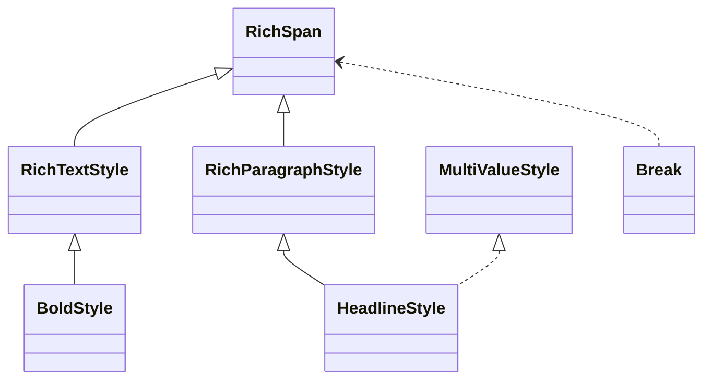

# Fu

Android 原生富文本编辑器

## 样式

```mermaid
classDiagram
    class RichSpan
    class RichTextStyle
    class RichParagraphStyle
    class MultiValueStyle
    class Break
    class BoldStyle
    class HeadlineStyle
    RichSpan <|-- RichTextStyle
    RichSpan <|-- RichParagraphStyle
    RichTextStyle <|-- BoldStyle
    RichParagraphStyle <|-- HeadlineStyle
    MultiValueStyle <|.. HeadlineStyle
    RichSpan <.. Break
```

RichEditText 对外暴露`toggle` 和`cursorStyle`，前者用来切换指定区域的格式，后者用来获取当前光标所在位置的样式。

RichEditText 仅能够感知`RichTextStyle`、 `RichParagraph`、 `MultiValueStyle`、 `Break`，可以随意扩充样式。