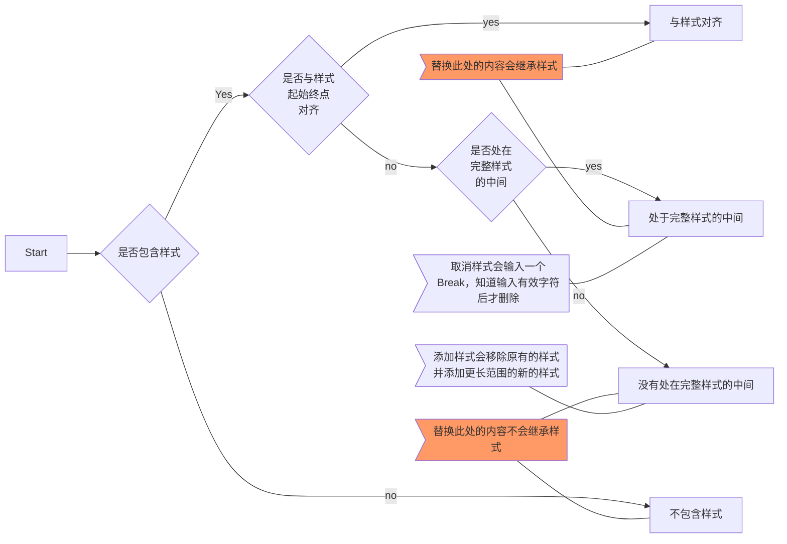

# Spec

[fu.drawio](fu.drawio)

RichEditText 会通过**cursorStyle** 提示当前光标所在位置的样式,即在此处输入新的字符将会继承的样式。
鉴于前者的提到的系统的默认行为，在计算样式时需要确保最后一个字符不是标点符号。

可以分割样式的标点符号通过**BREAK_CHARACTER** 定义。

不管是Character 型Style 还是Paragraph 型Style，在后面追加字符时都会自动应用样式，除非紧挨着个字符是标点符合。
此时通过计算光标得到的对应的样式应该是false，因为继续输入字符时并不会继承前面的样式。
但是依然可以通过手动选中样式来确保后续输入的内容是包含样式的。

如果用户反选当前光标，会插入一个特殊的Span，名为**Break**，并且在输入有效的字符后会被删除。如果Break
被一种样式包裹，除了前面的处理外，还会分割此样式。

Break 取消是还需要判断是否需要合并前后的样式。

